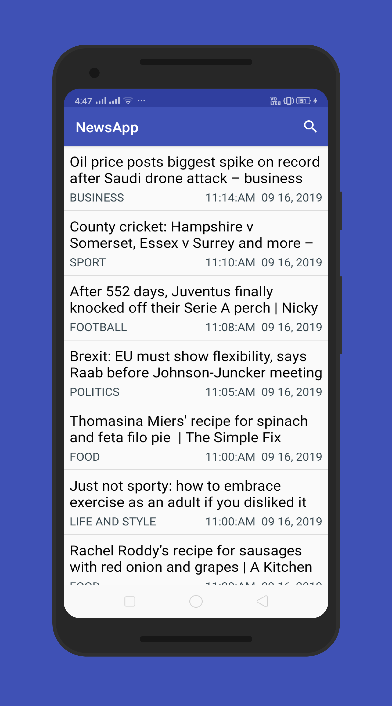
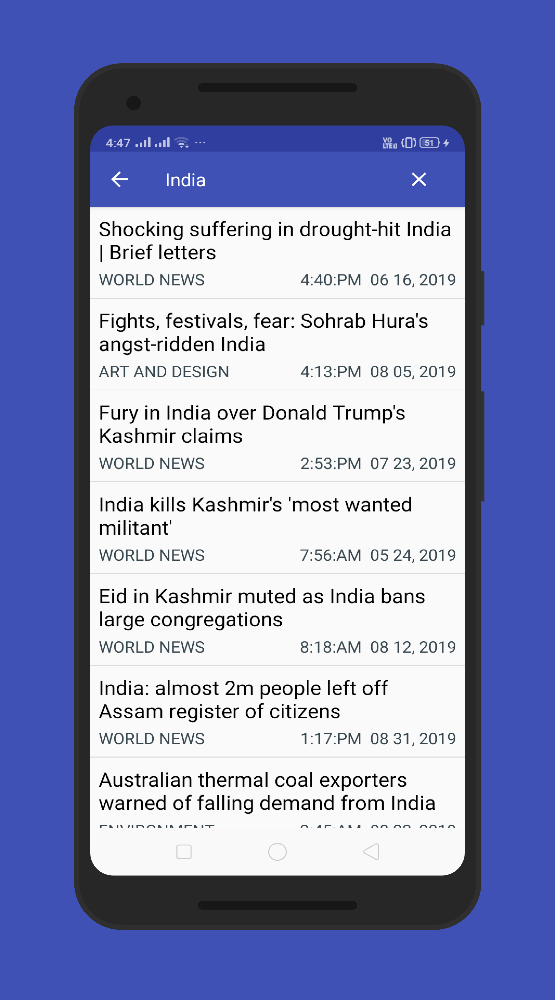

# NewsApp
The goal is to create a News feed app which gives a user regularly-updated news from the internet related to a particular topic, person, or location. The presentation of the information as well as the topic is up to you.

#### What I've learned from this project?
This project is about combining various ideas and skills I’ve been practicing throughout the course. They include:

* Connecting to an API
* Parsing the response of the API
* Handling error cases gracefully
* Updating information regularly
* Doing network operations independent of the Activity lifecycle

## Screenshots

&ensp;
